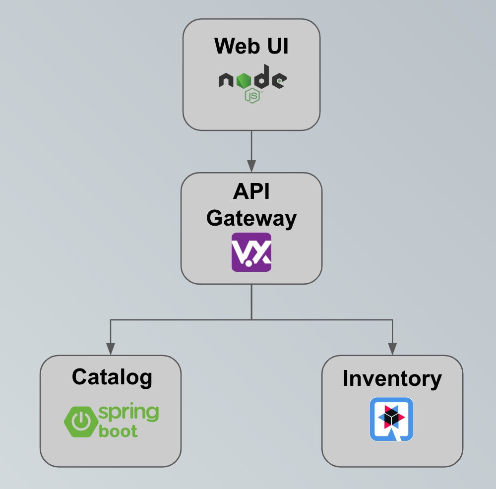

# Cloud Native Workshop

<a href="https://codeready-che.apps.cluster-techtalk-9f28.techtalk-9f28.example.opentlc.com/factory?url=https://github.com/Red-Wine-Software/cloud-native-workshop/tree/ocp4.5-demo" target="_blank"></a>


## Overview

This one day hands-on cloud-native workshops provides developers and introduction to cloud-natives applications
and gives them an experience of building cloud-native applications using OpenShift, Eclipse Che7, Spring Boot,
Quarkus, Vert.x and more.



During the various steps of the the workshop you will use CodeReady Workspaces, an online IDE that is running on Red Hat OpenShift to write, test and deploy these services:

* **Catalog Service** exposes using a REST API content of a catalog stored in a relational database
* **Inventory Service** exposes using a REST API the inventory stored in a relational database
* **Gateway Service** calls the **Catalog Service** and **Inventory Service** in an efficient way
* **WebUI Service** calls **Gateway Service** to retrieve all the informations.

The outcome is an online store with a catalog of product items and an inventory of stock:


In addition to the application code, you will learn how to deploy the various services to OpenShift and how to use it to route the trafic to these services and monitor them.

You will also have the opportunity to look at some optional steps such as debugging, continuous delivery, externalized configuration and more.

Let's start the workshop with the discovery of OpenShift and CodeReady Workspaces.

## Agenda

* Introduction to Cloud-Native Development
* Getting your Developer Workspace with Eclipse Che7
* Building Services with Quarkus
* Building Services with Spring Boot
* Building Reactive Services with Vert.x
* Monitoring Application Health
* Service Resilience and Fault Tolerance
* Externalize Application Configuration
* Building Cloud-Native Pipelines with Tekton
* Connecting and monitoring microservice applications with Service Mesh
* Setting up A/B Testing with Service Mesh

## Deploy the Workshop on RHPDS

An [Operator](https://docs.openshift.com/container-platform/4.2/operators/olm-what-operators-are.html)
is provided for deploying the workshop infrastructure (lab instructions, Nexus, Gitea, Eclipse Che, etc)
on OpenShift.

Please follow the instructions from [OpenShift Workshop Operator](https://github.com/mcouliba/openshift-workshop-operator)
and deploy the following **Workshop** custom resource [cloud_native_workshop_cr.yaml](https://github.com/mcouliba/openshift-workshop-operator/blob/master/deploy/crds/cloud_native_workshop_cr.yaml)

## Run locally the lab instructions

In order to run the guide locally, please follow the instructions below:

```
$ git clone
$ cd cloud-native-workshop/guide
$ docker run -it --rm -p 8080:8080 \
      -v $(pwd):/app-data \
      -e LOG_TO_STDOUT#true \
      -e CONTENT_URL_PREFIX#"file:///app-data" \
      -e WORKSHOPS_URLS#"file:///app-data/_workshop.yml" \
      quay.io/osevg/workshopper:latest
```
